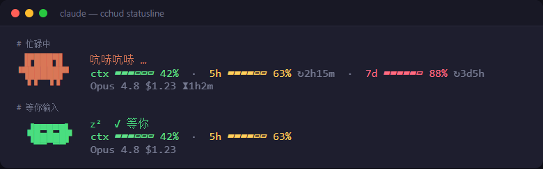

# cchud

> Claude Code 状态栏小兽 —— 一只会随状态切换姿势的像素小兽，外加上下文 / 用量 / 模型 / 花费一目了然。

`cchud` 是给 [Claude Code](https://claude.com/claude-code) 用的 `statusLine` 脚本。它从 stdin 读取 Claude Code 传入的会话 JSON，输出三行带颜色的终端状态栏。

## 效果



上图为同一脚本在两种状态下的实际输出：**忙碌中**（橙色，小兽站立睁眼）与**等你输入**（绿色，小兽蜷缩低头打盹）。

显示内容：

- **小兽姿势 + 颜色** —— 通过读取会话日志最后一个有意义事件推断「忙碌 / 等你」，比看文件 mtime 更准。
- **ctx** —— 上下文窗口占用百分比。
- **5h / 7d** —— 5 小时 / 7 天用量额度，带重置倒计时（`↻`）。
- **进度条颜色** —— 绿(<60%) / 黄(60-85%) / 红(≥85%)。
- **尾行** —— 待办完成数（`✓3/5`）、模型名、本次花费、累计时长。

## 安装

需要本机有 [Node.js](https://nodejs.org/)（任意较新版本即可，脚本无依赖）。

把仓库克隆到任意位置：

```sh
git clone https://github.com/x-wink/cchud.git
```

然后编辑 `~/.claude/settings.json`，加入 `statusLine` 字段。

### macOS / Linux

```jsonc
{
  "statusLine": {
    "type": "command",
    "command": "/path/to/cchud/hud.sh"
  }
}
```

记得给启动器加可执行权限：`chmod +x /path/to/cchud/hud.sh`。

### Windows

直接用 `node` 调用 `hud.js`（注意 JSON 里反斜杠要转义）：

```jsonc
{
  "statusLine": {
    "type": "command",
    "command": "node \"C:\\path\\to\\cchud\\hud.js\""
  }
}
```

保存后重启 Claude Code（或新开会话）即可生效。

## 答完提醒（可选）

`notify.js` 可在 Claude Code「答完、把控制权交还给你」的那一刻弹**桌面通知 + 播提示音**，方便你挂着别的事时被叫回来。它借助 Claude Code 的 `Stop` 钩子（每次主对话停止时触发，正好对应小兽从「忙碌」切到「等你」）。

跨平台：Windows 用 PowerShell WinRT Toast + 系统提示音，macOS 用 `osascript`，Linux 用 `notify-send` + `paplay`。

在 `settings.json` 里和 `statusLine` 同级加入 `hooks`：

```jsonc
{
  "hooks": {
    "Stop": [
      {
        "hooks": [{ "type": "command", "command": "node \"C:\\path\\to\\cchud\\notify.js\"" }]
      }
    ]
  }
}
```

通知里会带上当前项目目录名，多个会话同时跑时一眼能认出是哪个项目答完了。Windows 上若通知没弹出，检查「设置 → 系统 → 通知」与「专注助手 / 勿扰模式」是否屏蔽了通知（提示音不受勿扰影响，仍会响）。

## 调试

不接 Claude Code 时，可手动喂一段假 JSON 预览效果：

```sh
echo '{"context_window":{"used_percentage":42},"rate_limits":{"five_hour":{"used_percentage":63}},"model":{"display_name":"Opus 4.8"},"cost":{"total_cost_usd":1.23}}' | HUD_FAKE_STATE=busy node hud.js
```

环境变量 `HUD_FAKE_STATE=busy|idle` 可强制小兽进入指定状态，方便调试。

生成预览页面（README 顶部的 `preview.png` 即截自此页面的终端元素）：

```sh
node tools/preview.js   # 输出 tools/preview.html，用浏览器打开即可预览两种状态
```

## 终端建议

状态栏用到真彩色 ANSI（`38;2;r;g;b`）和 Unicode 方块字符。在 Windows Terminal、VS Code 集成终端、iTerm2 等现代终端显示最佳；老式 conhost（cmd.exe 默认窗口）可能配色或对齐不理想。

## License

MIT
